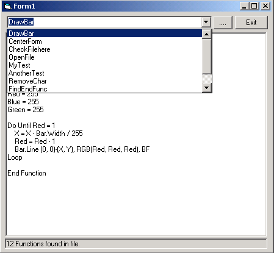



## List VB Functions

### Description

Hi this is a project that will allow you to open a bas file or form and list all the function in a combo box. then you can select the function name form the combo box and it will display that function in a text box. at this time it only works in function names eg function centerform(frm as form) but you can change it to do other string like sub or private subs anyway have a look at the example.txt I have left in the folder and open that up and you will see. anyway I hope that someone might find some us of it please vote if you like it... bye... :)
 
### More Info
 

             |
---                |---
**Submitted On**   |2001-04-12 12:56:28
**By**             |[dreamvb](https://github.com/Planet-Source-Code/PSCIndex/blob/master/ByAuthor/dreamvb.md)
**Level**          |Beginner
**User Rating**    |5.0 (25 globes from 5 users)
**Compatibility**  |VB 6\.0
**Category**       |[String Manipulation](https://github.com/Planet-Source-Code/PSCIndex/blob/master/ByCategory/string-manipulation__1-5.md)
**World**          |[Visual Basic](https://github.com/Planet-Source-Code/PSCIndex/blob/master/ByWorld/visual-basic.md)
**Archive File**   |[List VB Fu185924202001\.zip](https://github.com/Planet-Source-Code/dreamvb-list-vb-functions__1-22548/archive/master.zip)

